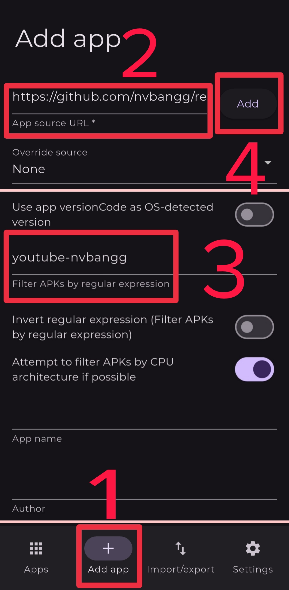

# 📱 Easily install and update apps with Obtainium:

## First, you need to download and install [Obtainium](https://github.com/ImranR98/Obtainium/releases) 

## How to add the app to Obtainium

### In step 2, Enter `https://github.com/nvbangg/revanced-morphe-builder`

- MicroG-RE: `https://github.com/MorpheApp/MicroG-RE`
- MicroG: `https://github.com/ReVanced/GmsCore`

### In step 3, Enter the expression for the app you want below:

- YouTube: `youtube-nvbangg`
- YouTube Morphe: `youtube-morphe`
- YouTube ReVanced: `youtube-revanced`
- YouTube Music: `youtube-music-morphe`
- YouTube Music ReVanced: `youtube-music-revanced`
- Google Photos: `google-photos-rookieenough`
- Google Photos ReVanced: `google-photos-revanced`

- Instagram: `instagram`
- Messenger: `messenger-rookieenough`
- Messenger ReVanced: `messenger-revanced`
- TikTok: `tiktok`
- Telegram: `telegram-aunali321`
- Telegram Web: `telegram-web-aunali321`
- X (Twitter): `twitter-revanced`
- X (Twitter) Piko: `twitter-crimera`
- Prime Video: `prime-video`
- Disney+: `disney-rookieenough`
- Disney+ ReVanced: `disney-revanced`
- WPS-Office: `wps-office`
- Duolingo: `duolingo`
- Cake: `cake`
- Twitch: `twitch`
- Reddit: `reddit`
- Photomath: `photomath-rookieenough`
- Photomath ReVanced: `photomath-revanced`
- Gboard: `gboard`
- Google Recorder: `google-recorder`
- SoundCloud: `soundcloud-rookieenough`
- SoundCloud ReVanced: `soundcloud-revanced`
- Pandora: `pandora`
- Tumblr: `tumblr-rookieenough`
- Tumblr ReVanced: `tumblr-revanced`
- Cricbuzz: `cricbuzz-rookieenough`
- Cricbuzz ReVanced: `cricbuzz-revanced`
- MyFitnessPal: `myfitnesspal`
- Strava: `strava-rookieenough`
- Strava ReVanced: `strava-revanced`
- Crunchyroll: `crunchyroll`
- Wallcraft: `wallcraft`
- ibis Paint X: `ibis-paint-x`
- RAR: `rar`
- Sofascore: `sofascore`
- FotMob: `fotmob`
- Windy: `windy`
- Proton VPN: `proton-vpn`
- Proton Mail: `proton-mail`
- Pixiv: `pixiv`
- Inshorts: `inshorts`
- Mimo: `mimo`
- Solid Explorer: `solid-explorer`
